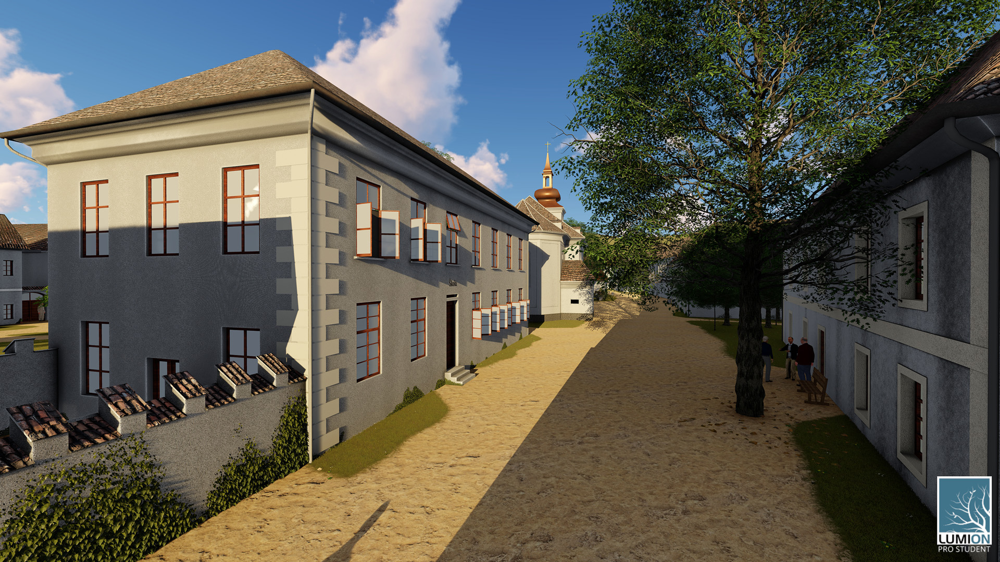
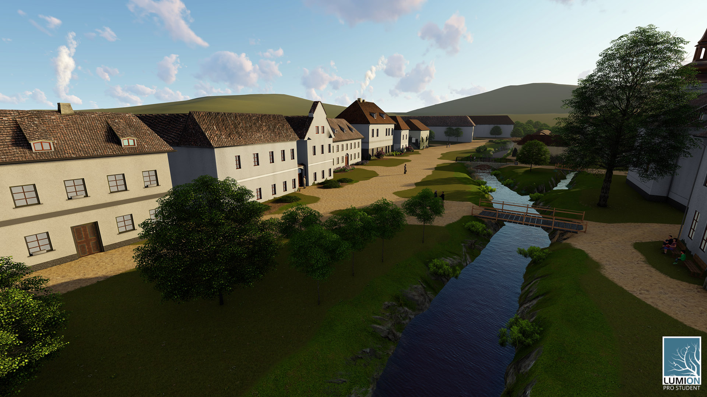

Jedná se o vizualizaci zaniklé obce Jablonec (Ogfolderhaid). Vesnice, včetně barokního kostela byla zničena v letech okolo roku 1950. Nyní se na tomto místě nachází vojenská základna s tankovou střílnou. 

Povrch země modelu byl vytvořen z digitálního vektorového modelu vrstevnic Zabaged. Velikost budov byla odhadnuta z dobových fotografií a změřena ze starých katastrálních map. Celý proces modelace je dostupný [zde.](https://drive.google.com/file/d/1w02unMZdq4FX71KxRKYxF9ETLqT3ZAy3/view?usp=sharing)

V tomto případě se jednalo o mojí první placenou zakázku pro katedru aplikované geografie, spolupracující s ministerstvem kultury. Projekt vznikl jako program na podporu aplikovaného výzkumu a vývoje národní a kulturní identity (NAKI). Více informací o obci lze najít [zde.](http://www.zaniklekrajiny.cz/atlas/modelova-uzemi/boletice)

<h3> Rendery </h3>

 

 

 

 

 

 

 

 

 

 

 

 

 

 

  
<h3> Porovnání dobových fotek s 3D modelem </h3>
Kliknutím se změní fotografie na dobovou fotografii
 

 

 
    
    
 

 

 

<h3> Video </h3>
<h5>Video zachycují průlet celou vesnicí Jablonec</h5>

<iframe width="560" height="315" src="https://www.youtube.com/embed/yBfG8Soaxw4" frameborder="0" allow="accelerometer; autoplay; encrypted-media; gyroscope; picture-in-picture" allowfullscreen></iframe>