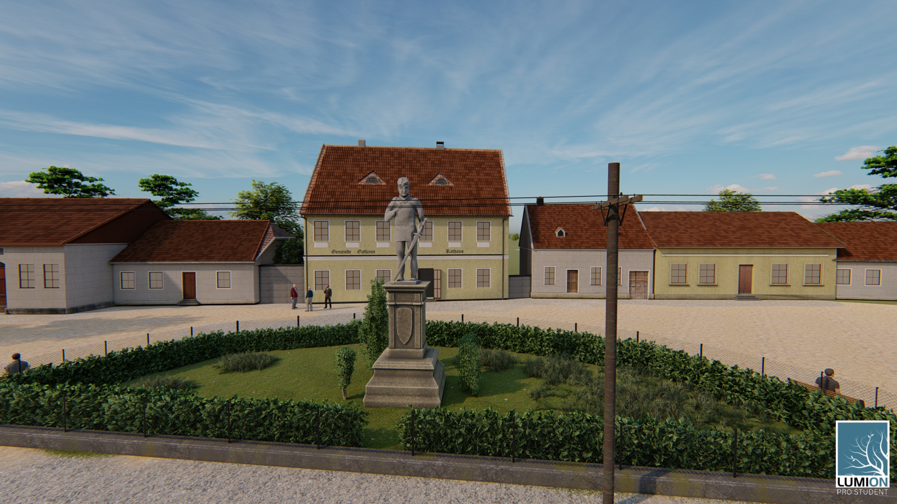

Toto je 3D vizualizace zaniklé obce Mušov (Muschau). Vesnice byla zatopena v roce 1978 vodní nádrží Nové Mlýny. Nyní se na tomto místě nachází pouze nepřístupný ostrov s kostelem. 

Povrch země 3D modelu byl získán interpolací z vrstevnic vektorového digitálního modelu Zabaged. Měřítko budov bylo změřeno z dobových fotografií a z dobové katastrální mapy. Sochy byly vymodelovýny v SW Mudbox. Celý postup tvorby je k dispozici [zde.](https://drive.google.com/file/d/12U5Q1p-7OHgOtkkkM6P-GssGBlXoA1Ia/view?usp=sharing)

V tomto případě se jednalo o mojí druhou placenou zakázku pro katedru aplikované geografie, spolupracující s ministerstvem kultury. Projekt vznikl jako program na podporu aplikovaného výzkumu a vývoje národní a kulturní identity (NAKI). 
Více infomrací o zaniklé vesnici k dispozici [zde.](http://www.zaniklekrajiny.cz/atlas/modelova-uzemi/novomlynske-nadrze) 
  
<h3> Interaktivní 3D model </h3>
<i>Pokud se 3D model nenačítá, prosím vypněte Adblock.
 
    
Pohybovat se lze pomocí zelených šipek umístěných v modelu. Zároveň je možné zapnout režim celé obrazovky a také lze spustit režim pro virtuální realitu. V panelu umístěném v pravé části okna lze zobrazit starou katastrální mapu a původní místo, kde se původně vesnice nacházela.

hosted with: Theasys.io
  
<h3> Rendery </h3>

 

 

 

 

 

 

 

 

 

 

 

 

 

 

 

  
<h3> Porovnání 3D modelu s dobovými fotografiemi </h3>
Kliknutím na fotografii lze porovnat render s dobovou fotografií

 

 

 

 
<h3> Video </h3>
Video zachycující průlet skrz celou vesnicí:
 
<iframe width="560" height="315" src="https://www.youtube.com/embed/NgXLj6BLhOU" frameborder="0" allow="accelerometer; autoplay; encrypted-media; gyroscope; picture-in-picture" allowfullscreen></iframe>